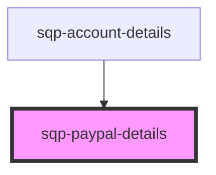

# sqp-account-details

<!-- Auto Generated Below -->

## Properties

| Property                         | Attribute                             | Description | Type                                                                                                                                                                                                                                                                                                                                                                                                                                                                                                                                      | Default     |
| -------------------------------- | ------------------------------------- | ----------- | ----------------------------------------------------------------------------------------------------------------------------------------------------------------------------------------------------------------------------------------------------------------------------------------------------------------------------------------------------------------------------------------------------------------------------------------------------------------------------------------------------------------------------------------- | ----------- |
| `additionalW9Text`               | `additional-w-9-text`                 |             | `string`                                                                                                                                                                                                                                                                                                                                                                                                                                                                                                                                  | `undefined` |
| `connectPayPalAccountButtonText` | `connect-pay-pal-account-button-text` |             | `string`                                                                                                                                                                                                                                                                                                                                                                                                                                                                                                                                  | `undefined` |
| `connectPayPalDescriptionText`   | `connect-pay-pal-description-text`    |             | `string`                                                                                                                                                                                                                                                                                                                                                                                                                                                                                                                                  | `undefined` |
| `demoData`                       | --                                    |             | `{ loading?: boolean; setOpen?: (open: boolean) => void; hasAccount?: boolean; integrationDisabled?: boolean; integrationPaused?: boolean; detailsHeaderText?: string; scheduleHeaderText?: string; detailsSlot?: VNode; scheduleSlot?: VNode \| VNode[]; editText?: string; integrationDisabledHeader?: string; integrationDisabledText?: string; integrationPausedHeader?: string; integrationPausedText?: string; payPalAccountHeaderText?: string; connectPayPalDescriptionText?: string; connectPayPalAccountButtonText?: string; }` | `undefined` |
| `detailsHeaderText`              | `details-header-text`                 |             | `string`                                                                                                                                                                                                                                                                                                                                                                                                                                                                                                                                  | `undefined` |
| `editText`                       | `edit-text`                           |             | `string`                                                                                                                                                                                                                                                                                                                                                                                                                                                                                                                                  | `undefined` |
| `hasAccount`                     | `has-account`                         |             | `boolean`                                                                                                                                                                                                                                                                                                                                                                                                                                                                                                                                 | `undefined` |
| `integrationDisabled`            | `integration-disabled`                |             | `boolean`                                                                                                                                                                                                                                                                                                                                                                                                                                                                                                                                 | `undefined` |
| `integrationDisabledHeader`      | `integration-disabled-header`         |             | `string`                                                                                                                                                                                                                                                                                                                                                                                                                                                                                                                                  | `undefined` |
| `integrationDisabledText`        | `integration-disabled-text`           |             | `string`                                                                                                                                                                                                                                                                                                                                                                                                                                                                                                                                  | `undefined` |
| `integrationPaused`              | `integration-paused`                  |             | `boolean`                                                                                                                                                                                                                                                                                                                                                                                                                                                                                                                                 | `undefined` |
| `integrationPausedHeader`        | `integration-paused-header`           |             | `string`                                                                                                                                                                                                                                                                                                                                                                                                                                                                                                                                  | `undefined` |
| `integrationPausedText`          | `integration-paused-text`             |             | `string`                                                                                                                                                                                                                                                                                                                                                                                                                                                                                                                                  | `undefined` |
| `loading`                        | `loading`                             |             | `boolean`                                                                                                                                                                                                                                                                                                                                                                                                                                                                                                                                 | `undefined` |
| `nextPayoutLabel`                | `next-payout-label`                   |             | `string`                                                                                                                                                                                                                                                                                                                                                                                                                                                                                                                                  | `undefined` |
| `otherCurrenciesLabel`           | `other-currencies-label`              |             | `string`                                                                                                                                                                                                                                                                                                                                                                                                                                                                                                                                  | `undefined` |
| `payPalAccountHeaderText`        | `pay-pal-account-header-text`         |             | `string`                                                                                                                                                                                                                                                                                                                                                                                                                                                                                                                                  | `undefined` |
| `pendingDetailedStatusText`      | `pending-detailed-status-text`        |             | `string`                                                                                                                                                                                                                                                                                                                                                                                                                                                                                                                                  | `undefined` |
| `pendingLabel`                   | `pending-label`                       |             | `string`                                                                                                                                                                                                                                                                                                                                                                                                                                                                                                                                  | `undefined` |
| `scheduleHeaderText`             | `schedule-header-text`                |             | `string`                                                                                                                                                                                                                                                                                                                                                                                                                                                                                                                                  | `undefined` |
| `setOpen`                        | --                                    |             | `(open: boolean) => void`                                                                                                                                                                                                                                                                                                                                                                                                                                                                                                                 | `undefined` |
| `upcomingPaymentLabel`           | `upcoming-payment-label`              |             | `string`                                                                                                                                                                                                                                                                                                                                                                                                                                                                                                                                  | `undefined` |
| `w9TaxLabel`                     | `w-9-tax-label`                       |             | `string`                                                                                                                                                                                                                                                                                                                                                                                                                                                                                                                                  | `undefined` |

## Dependencies

### Used by

 - [sqp-account-details](.)

### Graph

----------------------------------------------

*Built with [StencilJS](https://stenciljs.com/)*
