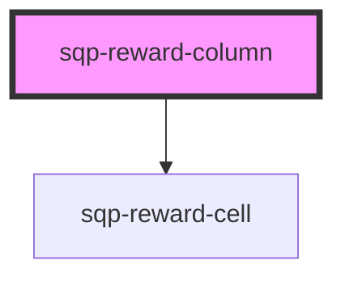

# sqp-reward-column

<!-- Auto Generated Below -->

## Properties

| Property             | Attribute              | Description                                                                   | Type      | Default                                                                                                                                                        |
| -------------------- | ---------------------- | ----------------------------------------------------------------------------- | --------- | -------------------------------------------------------------------------------------------------------------------------------------------------------------- |
| `columnTitle`        | `column-title`         |                                                                               | `string`  | `"Rewards"`                                                                                                                                                    |
| `expiringText`       | `expiring-text`        | Shown in the dropdown details when a reward has an expiry date.               | `string`  | `"Expiring in"`                                                                                                                                                |
| `fuelTankText`       | `fuel-tank-text`       | Shown in the dropdown details when a reward has an associated fuel tank code. | `string`  | `"Your code is"`                                                                                                                                               |
| `hideDetails`        | `hide-details`         |                                                                               | `boolean` | `false`                                                                                                                                                        |
| `pendingForText`     | `pending-for-text`     | Shown in the dropdown details when a reward is pending.                       | `string`  | `"{status} for {date}"`                                                                                                                                        |
| `rewardReceivedText` | `reward-received-text` | Shown in the dropdown details when a reward has been received.’               | `string`  | `"Reward received on"`                                                                                                                                         |
| `statusLongText`     | `status-long-text`     | Additional status text shown in the details drop down.                        | `string`  | `"{status, select, AVAILABLE {Reward expiring on} CANCELLED {Reward cancelled on} PENDING {Available on} EXPIRED {Reward expired on} other {Not available} }"` |
| `statusText`         | `status-text`          | Text shown in the reward status badge.                                        | `string`  | `"{status, select, AVAILABLE {Available} CANCELLED {Cancelled} PENDING {Pending} EXPIRED {Expired} REDEEMED {Redeemed} other {Not available} }"`               |

## Methods

### `renderCell(_data: Referral, _locale: string) => Promise<any>`

#### Returns

Type: `Promise<any>`

### `renderLabel() => Promise<string>`

#### Returns

Type: `Promise<string>`

### `renderReferrerCell(_data: Referrer) => Promise<any>`

#### Returns

Type: `Promise<any>`

## Dependencies

### Depends on

- [sqp-reward-cell](../sqp-reward-cell)

### Graph

----------------------------------------------

*Built with [StencilJS](https://stenciljs.com/)*
