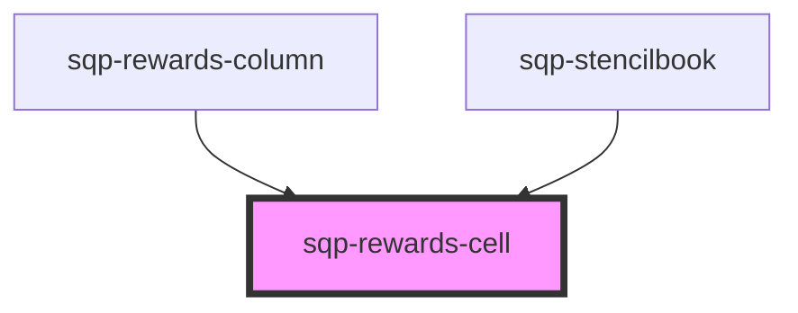

# sqp-rewards-cell

<!-- Auto Generated Below -->

## Properties

| Property                     | Attribute                        | Description | Type       | Default     |
| ---------------------------- | -------------------------------- | ----------- | ---------- | ----------- |
| `expiringText`               | `expiring-text`                  |             | `string`   | `undefined` |
| `fuelTankText`               | `fuel-tank-text`                 |             | `string`   | `undefined` |
| `hideDetails`                | `hide-details`                   |             | `boolean`  | `undefined` |
| `locale`                     | `locale`                         |             | `string`   | `"en"`      |
| `pendingForText`             | `pending-for-text`               |             | `string`   | `undefined` |
| `rewardPaidOutText`          | `reward-paid-out-text`           |             | `string`   | `undefined` |
| `rewardPayoutFailedText`     | `reward-payout-failed-text`      |             | `string`   | `undefined` |
| `rewardPayoutInProgressText` | `reward-payout-in-progress-text` |             | `string`   | `undefined` |
| `rewardReceivedText`         | `reward-received-text`           |             | `string`   | `undefined` |
| `rewards`                    | --                               |             | `Reward[]` | `undefined` |
| `statusLongText`             | `status-long-text`               |             | `string`   | `undefined` |
| `statusText`                 | `status-text`                    |             | `string`   | `undefined` |

## Dependencies

### Used by

 - [sqp-rewards-column](../sqp-rewards-column)
 - [sqp-stencilbook](../sqp-stencilbook)

### Graph

----------------------------------------------

*Built with [StencilJS](https://stenciljs.com/)*
