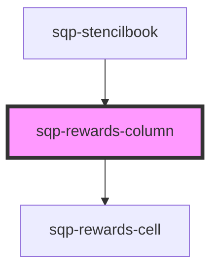

# sqp-rewards-column

<!-- Auto Generated Below -->

## Properties

| Property                     | Attribute                        | Description                                                                   | Type      | Default                                                                                                                                                                                                                                  |
| ---------------------------- | -------------------------------- | ----------------------------------------------------------------------------- | --------- | ---------------------------------------------------------------------------------------------------------------------------------------------------------------------------------------------------------------------------------------- |
| `columnTitle`                | `column-title`                   |                                                                               | `string`  | `"Rewards"`                                                                                                                                                                                                                              |
| `expiringText`               | `expiring-text`                  | Shown in the dropdown details when a reward has an expiry date.               | `string`  | `"Expiring in"`                                                                                                                                                                                                                          |
| `fuelTankText`               | `fuel-tank-text`                 | Shown in the dropdown details when a reward has an associated fuel tank code. | `string`  | `"Your code is"`                                                                                                                                                                                                                         |
| `hideDetails`                | `hide-details`                   |                                                                               | `boolean` | `false`                                                                                                                                                                                                                                  |
| `pendingForText`             | `pending-for-text`               | Shown in the dropdown details when a reward is pending.                       | `string`  | `"{status} for {date}"`                                                                                                                                                                                                                  |
| `rewardPaidOutText`          | `reward-paid-out-text`           | Shown in the dropdown details when a reward has been paid out.’               | `string`  | `"Sent via PayPal on"`                                                                                                                                                                                                                   |
| `rewardPayoutFailedText`     | `reward-payout-failed-text`      | Shown in the dropdown details when a reward payout has failed.’               | `string`  | `"Payout last attempted on"`                                                                                                                                                                                                             |
| `rewardPayoutInProgressText` | `reward-payout-in-progress-text` | Shown in the dropdown details when a reward is being paid out.’               | `string`  | `"PayPal payout processing started on"`                                                                                                                                                                                                  |
| `rewardReceivedText`         | `reward-received-text`           | Shown in the dropdown details when a reward has been received.’               | `string`  | `"Reward received on"`                                                                                                                                                                                                                   |
| `statusLongText`             | `status-long-text`               | Additional status text shown in the details drop down.                        | `string`  | `"{status, select, INPROGRESS {In Progress} TRANSFERRED {Transferred} FAILED {Payout Failed} AVAILABLE {Reward expiring on} CANCELLED {Reward cancelled on} PENDING {Available on} EXPIRED {Reward expired on} other {Not available} }"` |
| `statusText`                 | `status-text`                    | Text shown in the reward status badge.                                        | `string`  | `"{status, select, INPROGRESS {In Progress} TRANSFERRED {Transferred} FAILED {Payout Failed} AVAILABLE {Available} CANCELLED {Cancelled} PENDING {Pending} EXPIRED {Expired} REDEEMED {Redeemed} other {Not available} }"`               |

## Methods

### `renderCell(data: Referral, locale: string, mintRenderer: any) => Promise<any>`

#### Returns

Type: `Promise<any>`

### `renderLabel() => Promise<string>`

#### Returns

Type: `Promise<string>`

### `renderReferrerCell(data: Referrer) => Promise<any>`

#### Returns

Type: `Promise<any>`

## Dependencies

### Used by

 - [sqp-stencilbook](../sqp-stencilbook)

### Depends on

- [sqp-rewards-cell](../sqp-rewards-cell)

### Graph

----------------------------------------------

*Built with [StencilJS](https://stenciljs.com/)*
