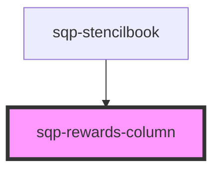

# sqp-rewards-column

<!-- Auto Generated Below -->

## Properties

| Property                     | Attribute                        | Description                                                                   | Type      | Default                                                                                                                                                                                                                                                                                                                                                                                                                                                                                                                                                                                                                                                                                                                                                                          |
| ---------------------------- | -------------------------------- | ----------------------------------------------------------------------------- | --------- | -------------------------------------------------------------------------------------------------------------------------------------------------------------------------------------------------------------------------------------------------------------------------------------------------------------------------------------------------------------------------------------------------------------------------------------------------------------------------------------------------------------------------------------------------------------------------------------------------------------------------------------------------------------------------------------------------------------------------------------------------------------------------------- |
| `columnTitle`                | `column-title`                   |                                                                               | `string`  | `"Rewards"`                                                                                                                                                                                                                                                                                                                                                                                                                                                                                                                                                                                                                                                                                                                                                                      |
| `expiringText`               | `expiring-text`                  | Shown in the dropdown details when a reward has an expiry date.               | `string`  | `"Expiring in"`                                                                                                                                                                                                                                                                                                                                                                                                                                                                                                                                                                                                                                                                                                                                                                  |
| `fuelTankText`               | `fuel-tank-text`                 | Shown in the dropdown details when a reward has an associated fuel tank code. | `string`  | `"Your code is"`                                                                                                                                                                                                                                                                                                                                                                                                                                                                                                                                                                                                                                                                                                                                                                 |
| `hideDetails`                | `hide-details`                   |                                                                               | `boolean` | `false`                                                                                                                                                                                                                                                                                                                                                                                                                                                                                                                                                                                                                                                                                                                                                                          |
| `integrationDomain`          | `integration-domain`             |                                                                               | `string`  | `"https://paypal-payouts-prod.herokuapp.com/graphql"`                                                                                                                                                                                                                                                                                                                                                                                                                                                                                                                                                                                                                                                                                                                            |
| `pendingForText`             | `pending-for-text`               | Shown in the dropdown details when a reward is pending.                       | `string`  | `"{status} for {date}"`                                                                                                                                                                                                                                                                                                                                                                                                                                                                                                                                                                                                                                                                                                                                                          |
| `rewardBlockedText`          | `reward-blocked-text`            | Shown in the dropdown details when a reward was blocked during payout.        | `string`  | `"Payout blocked on {date}."`                                                                                                                                                                                                                                                                                                                                                                                                                                                                                                                                                                                                                                                                                                                                                    |
| `rewardDeniedText`           | `reward-denied-text`             | Shown in the dropdown details when a reward was denied during payout.         | `string`  | `"Payout denied by PayPal on {date}."`                                                                                                                                                                                                                                                                                                                                                                                                                                                                                                                                                                                                                                                                                                                                           |
| `rewardOnHoldText`           | `reward-on-hold-text`            | Shown in the dropdown details when a reward was placed on hold during payout. | `string`  | `"Payout on hold and in review since {date}."`                                                                                                                                                                                                                                                                                                                                                                                                                                                                                                                                                                                                                                                                                                                                   |
| `rewardPaidOutText`          | `reward-paid-out-text`           | Shown in the dropdown details when a reward has been paid out.                | `string`  | `"Paid out on {date}."`                                                                                                                                                                                                                                                                                                                                                                                                                                                                                                                                                                                                                                                                                                                                                          |
| `rewardPayoutFailedText`     | `reward-payout-failed-text`      | Shown in the dropdown details when a reward payout has failed.                | `string`  | `"This payout will be retried up to 3 times. If it still fails it will be retried in the next payout cycle. Last attempted on {date}."`                                                                                                                                                                                                                                                                                                                                                                                                                                                                                                                                                                                                                                          |
| `rewardPayoutInProgressText` | `reward-payout-in-progress-text` | Shown in the dropdown details when a reward is being paid out.                | `string`  | `"Payout processing started on {date}."`                                                                                                                                                                                                                                                                                                                                                                                                                                                                                                                                                                                                                                                                                                                                         |
| `rewardReceivedText`         | `reward-received-text`           | Shown in the dropdown details when a reward has been received.                | `string`  | `"Reward received on"`                                                                                                                                                                                                                                                                                                                                                                                                                                                                                                                                                                                                                                                                                                                                                           |
| `rewardRefundedText`         | `reward-refunded-text`           | Shown in the dropdown details when a reward was refunded after payout.        | `string`  | `"Payout refunded on {date}."`                                                                                                                                                                                                                                                                                                                                                                                                                                                                                                                                                                                                                                                                                                                                                   |
| `rewardReturnedText`         | `reward-returned-text`           | Shown in the dropdown details when a reward was returned after payout.        | `string`  | `"The email you provided does not link to an existing PayPal account. Payout expired on {date}."`                                                                                                                                                                                                                                                                                                                                                                                                                                                                                                                                                                                                                                                                                |
| `rewardReversedText`         | `reward-reversed-text`           | Shown in the dropdown details when a rewards payout was reversed.             | `string`  | `"Payout reversed on {date}."`                                                                                                                                                                                                                                                                                                                                                                                                                                                                                                                                                                                                                                                                                                                                                   |
| `rewardUnclaimedText`        | `reward-unclaimed-text`          | Shown in the dropdown details when a reward was paid out but is unclaimed.    | `string`  | `"The email you provided does not link to an existing PayPal account. Payout expires on {date}."`                                                                                                                                                                                                                                                                                                                                                                                                                                                                                                                                                                                                                                                                                |
| `statusLongText`             | `status-long-text`               | Additional status text shown in the details drop down.                        | `string`  | `"{status, select, INPROGRESS {In Progress} TRANSFERRED {Transferred} AVAILABLE {Reward expiring on} CANCELLED {Reward cancelled on} REDEEMED {Redeemed on} PENDING {Available on} EXPIRED {Reward expired on} SUCCESS {Paid out on} FAILED {This payout will be retried up to 3 times. If it still fails it will be retried in the next payout cycle. Last attempted on} PAYPAL_PENDING {Payout process started on} UNCLAIMED {The email you provided does not link to an existing PayPal account. Payout expires on} ONHOLD {Payout on hold and in review since} REFUNDED {Payout refunded on} RETURNED {Payout returned on} REVERSED {Payout reversed on} BLOCKED {Payout blocked on} W9_PENDING {W-9 required} DENIED {Payout denied by PayPal on} other {Not available} }"` |
| `statusText`                 | `status-text`                    | Define the text shown in the reward status badge.                             | `string`  | `"{status, select, AVAILABLE {Available} CANCELLED {Cancelled} EXPIRED {Expired} REDEEMED {Redeemed} PENDING {Pending} SUCCESS {Paid out} FAILED {Failed} PAYPAL_PENDING {In progress} UNCLAIMED {Unclaimed} ONHOLD {In progress} REFUNDED {Refunded} RETURNED {Returned} REVERSED {Reversed} BLOCKED {Blocked} W9_PENDING {Pending} DENIED {Denied} other {Not available}  }"`                                                                                                                                                                                                                                                                                                                                                                                                  |

## Methods

### `renderCell(data: Referral, locale: string, mintRenderer: any) => Promise<any>`

#### Returns

Type: `Promise<any>`

### `renderLabel() => Promise<string>`

#### Returns

Type: `Promise<string>`

### `renderReferrerCell(data: Referrer, mintRenderer: any) => Promise<any>`

#### Returns

Type: `Promise<any>`

## Dependencies

### Used by

 - [sqp-stencilbook](../sqp-stencilbook)

### Graph

----------------------------------------------

*Built with [StencilJS](https://stenciljs.com/)*
