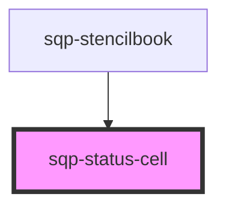

# sqp-status-cell

<!-- Auto Generated Below -->

## Properties

| Property                     | Attribute                        | Description | Type       | Default                                                                                                                         |
| ---------------------------- | -------------------------------- | ----------- | ---------- | ------------------------------------------------------------------------------------------------------------------------------- |
| `baseUnits`                  | --                               |             | `string[]` | `undefined`                                                                                                                     |
| `expiryText`                 | `expiry-text`                    |             | `string`   | `"Expires"`                                                                                                                     |
| `locale`                     | `locale`                         |             | `string`   | `"en"`                                                                                                                          |
| `pendingScheduled`           | `pending-scheduled`              |             | `string`   | `"Until"`                                                                                                                       |
| `pendingUnhandled`           | `pending-unhandled`              |             | `string`   | `"Fulfillment error"`                                                                                                           |
| `pendingUsTax`               | `pending-us-tax`                 |             | `string`   | `"W-9 required"`                                                                                                                |
| `reward`                     | --                               |             | `Reward`   | `undefined`                                                                                                                     |
| `rewardBlockedText`          | `reward-blocked-text`            |             | `string`   | `"Payout blocked on"`                                                                                                           |
| `rewardDeniedText`           | `reward-denied-text`             |             | `string`   | `""`                                                                                                                            |
| `rewardOnHoldText`           | `reward-on-hold-text`            |             | `string`   | `"Payout on hold and in review since"`                                                                                          |
| `rewardPaidOutText`          | `reward-paid-out-text`           |             | `string`   | `"Paid out on"`                                                                                                                 |
| `rewardPayoutFailedText`     | `reward-payout-failed-text`      |             | `string`   | `"This payout will be retried up to 3 times. If it still fails it will be retried in the next payout cycle. Last attempted on"` |
| `rewardPayoutInProgressText` | `reward-payout-in-progress-text` |             | `string`   | `"Payout process started on"`                                                                                                   |
| `rewardRefundedText`         | `reward-refunded-text`           |             | `string`   | `"Payout refunded on"`                                                                                                          |
| `rewardReturnedText`         | `reward-returned-text`           |             | `string`   | `"The email you provided does not link to an exisiting PayPal account. Payout expired on"`                                      |
| `rewardReversedText`         | `reward-reversed-text`           |             | `string`   | `"Payout reversed on"`                                                                                                          |
| `rewardUnclaimedText`        | `reward-unclaimed-text`          |             | `string`   | `"The email you provided does not link to an exisiting PayPal account. Payout expires on"`                                      |
| `statusText`                 | `status-text`                    |             | `string`   | `undefined`                                                                                                                     |

## Dependencies

### Used by

 - [sqp-stencilbook](../sqp-stencilbook)

### Graph

----------------------------------------------

*Built with [StencilJS](https://stenciljs.com/)*
