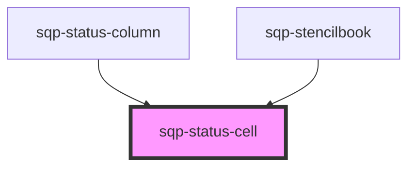

# sqp-status-cell

<!-- Auto Generated Below -->

## Properties

| Property                     | Attribute                        | Description | Type     | Default               |
| ---------------------------- | -------------------------------- | ----------- | -------- | --------------------- |
| `expiryText`                 | `expiry-text`                    |             | `string` | `"Expires"`           |
| `locale`                     | `locale`                         |             | `string` | `"en"`                |
| `pendingScheduled`           | `pending-scheduled`              |             | `string` | `"Until"`             |
| `pendingUnhandled`           | `pending-unhandled`              |             | `string` | `"Fulfillment error"` |
| `pendingUsTax`               | `pending-us-tax`                 |             | `string` | `"W-9 required"`      |
| `reward`                     | --                               |             | `Reward` | `undefined`           |
| `rewardPaidOutText`          | `reward-paid-out-text`           |             | `string` | `undefined`           |
| `rewardPayoutFailedText`     | `reward-payout-failed-text`      |             | `string` | `undefined`           |
| `rewardPayoutInProgressText` | `reward-payout-in-progress-text` |             | `string` | `undefined`           |
| `rewardUnclaimedText`        | `reward-unclaimed-text`          |             | `string` | `undefined`           |
| `statusText`                 | `status-text`                    |             | `string` | `undefined`           |

## Dependencies

### Used by

 - [sqp-status-column](../sqp-status-column)
 - [sqp-stencilbook](../sqp-stencilbook)

### Graph

----------------------------------------------

*Built with [StencilJS](https://stenciljs.com/)*
