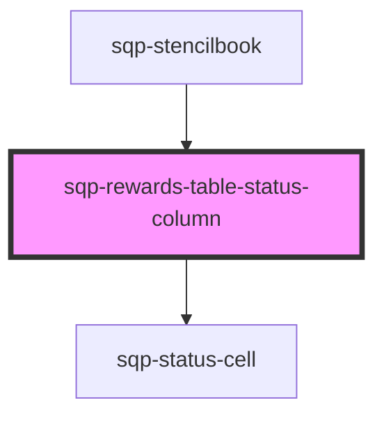

# sqp-status-column

<!-- Auto Generated Below -->

## Properties

| Property           | Attribute           | Description                                                      | Type     | Default                                                                                                                                                                                                             |
| ------------------ | ------------------- | ---------------------------------------------------------------- | -------- | ------------------------------------------------------------------------------------------------------------------------------------------------------------------------------------------------------------------- |
| `columnTitle`      | `column-title`      |                                                                  | `string` | `"Status"`                                                                                                                                                                                                          |
| `expiryText`       | `expiry-text`       | Text shown before the date of an expiring reward.                | `string` | `"Expires on "`                                                                                                                                                                                                     |
| `pendingScheduled` | `pending-scheduled` | Text shown before the available date of a pending reward.        | `string` | `"Until"`                                                                                                                                                                                                           |
| `pendingUnhandled` | `pending-unhandled` | Displayed when fulfillment error occured when creating a reward. | `string` | `"Fulfillment error"`                                                                                                                                                                                               |
| `pendingUsTax`     | `pending-us-tax`    | Displayed when a reward is pending due to W9 compliance.         | `string` | `"W-9 required"`                                                                                                                                                                                                    |
| `statusText`       | `status-text`       |                                                                  | `string` | `"{status, select, INPROGRESS {In Progress} TRANSFERRED {Transferred} FAILED {Failed} AVAILABLE {Available} CANCELLED {Cancelled} PENDING {Pending} EXPIRED {Expired} REDEEMED {Redeemed} other {Not available} }"` |

## Methods

### `renderCell(data: Reward, locale: string) => Promise<any>`

#### Returns

Type: `Promise<any>`

### `renderLabel() => Promise<string>`

#### Returns

Type: `Promise<string>`

## Dependencies

### Used by

 - [sqp-stencilbook](../sqp-stencilbook)

### Depends on

- [sqp-status-cell](../sqp-status-cell)

### Graph

----------------------------------------------

*Built with [StencilJS](https://stenciljs.com/)*
