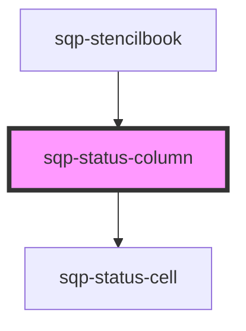

# sqp-status-column

<!-- Auto Generated Below -->

## Properties

| Property                     | Attribute                        | Description                                                                              | Type     | Default                                                                                                                                                                                                                                                                                                                                                    |
| ---------------------------- | -------------------------------- | ---------------------------------------------------------------------------------------- | -------- | ---------------------------------------------------------------------------------------------------------------------------------------------------------------------------------------------------------------------------------------------------------------------------------------------------------------------------------------------------------- |
| `columnTitle`                | `column-title`                   |                                                                                          | `string` | `"Status"`                                                                                                                                                                                                                                                                                                                                                 |
| `expiryText`                 | `expiry-text`                    | Text shown before the date of an expiring reward. Example: Expires on {date}.            | `string` | `"Expires on "`                                                                                                                                                                                                                                                                                                                                            |
| `integrationDomain`          | `integration-domain`             |                                                                                          | `string` | `"https://paypal-payouts-staging.herokuapp.com/graphql"`                                                                                                                                                                                                                                                                                                   |
| `pendingScheduled`           | `pending-scheduled`              | Text shown before the available date of a pending reward. Example: Pending until {date}. | `string` | `"Until"`                                                                                                                                                                                                                                                                                                                                                  |
| `pendingUnhandled`           | `pending-unhandled`              | Shown below the status when a fulfillment error occured when creating a reward.          | `string` | `"Fulfillment error"`                                                                                                                                                                                                                                                                                                                                      |
| `pendingUsTax`               | `pending-us-tax`                 | Shown below the status when a reward is pending due to W-9 compliance.                   | `string` | `"W-9 required"`                                                                                                                                                                                                                                                                                                                                           |
| `rewardBlockedText`          | `reward-blocked-text`            | Shown below the status when a reward was blocked during payout.                          | `string` | `"Payout blocked on"`                                                                                                                                                                                                                                                                                                                                      |
| `rewardDeniedText`           | `reward-denied-text`             | Shown below the status pill when a reward was denied during payout.                      | `string` | `"Payout denied by PayPal on"`                                                                                                                                                                                                                                                                                                                             |
| `rewardOnHoldText`           | `reward-on-hold-text`            | Shown below the status when a reward was placed on hold during payout.                   | `string` | `"Payout on hold and in review since"`                                                                                                                                                                                                                                                                                                                     |
| `rewardPaidOutText`          | `reward-paid-out-text`           | Shown below the status pill when a reward has been paid out.                             | `string` | `"Paid out on"`                                                                                                                                                                                                                                                                                                                                            |
| `rewardPayoutFailedText`     | `reward-payout-failed-text`      | Shown below the status when a reward has failed.                                         | `string` | `"This payout will be retried up to 3 times. If it still fails it will be retried in the next payout cycle. Last attempted on"`                                                                                                                                                                                                                            |
| `rewardPayoutInProgressText` | `reward-payout-in-progress-text` | Shown below the status when a reward is being paid out.                                  | `string` | `"Payout process started on"`                                                                                                                                                                                                                                                                                                                              |
| `rewardRefundedText`         | `reward-refunded-text`           | Shown below the status pill when a reward was refunded after payout.                     | `string` | `"Payout refunded on"`                                                                                                                                                                                                                                                                                                                                     |
| `rewardReturnedText`         | `reward-returned-text`           | Shown below the status pill when a reward was returned after payout.                     | `string` | `"The email you provided does not link to an existing PayPal account. Payout expired on"`                                                                                                                                                                                                                                                                  |
| `rewardReversedText`         | `reward-reversed-text`           | Shown below the status pill when a rewards payout was reversed.                          | `string` | `"Payout reversed on"`                                                                                                                                                                                                                                                                                                                                     |
| `rewardUnclaimedText`        | `reward-unclaimed-text`          | Shown below the status pill when a reward was paid out but is unclaimed.                 | `string` | `"The email you provided does not link to an existing PayPal account. Payout expires on"`                                                                                                                                                                                                                                                                  |
| `statusText`                 | `status-text`                    | Define the text shown in the reward status badge.                                        | `string` | `"{status, select, AVAILABLE {Available} CANCELLED {Cancelled} EXPIRED {Expired} REDEEMED {Redeemed} PENDING {Pending} SUCCESS {Paid out} FAILED {Failed} PAYPAL_PENDING {In progress} UNCLAIMED {Unclaimed} ONHOLD {In progress} REFUNDED {Refunded} RETURNED {Returned} REVERSED {Reversed} BLOCKED {Blocked} DENIED {Denied} other {Not available}  }"` |

## Methods

### `renderCell(data: Reward, locale: string, mintRenderer: any) => Promise<any>`

#### Returns

Type: `Promise<any>`

### `renderLabel() => Promise<string>`

#### Returns

Type: `Promise<string>`

## Dependencies

### Used by

 - [sqp-stencilbook](../sqp-stencilbook)

### Depends on

- [sqp-status-cell](../sqp-status-cell)

### Graph

----------------------------------------------

*Built with [StencilJS](https://stenciljs.com/)*
