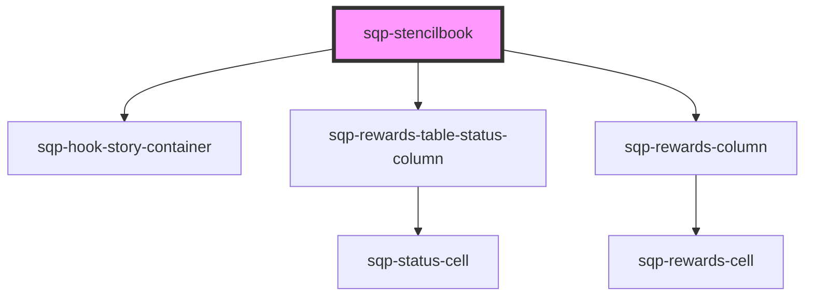

# sqp-stencilbook

<!-- Auto Generated Below -->

## Dependencies

### Depends on

- [sqp-hook-story-container](../sqp-hook-story-container)
- [sqp-rewards-table-status-column](../sqp-status-column)
- [sqp-rewards-column](../sqp-rewards-column)

### Graph

----------------------------------------------

*Built with [StencilJS](https://stenciljs.com/)*
