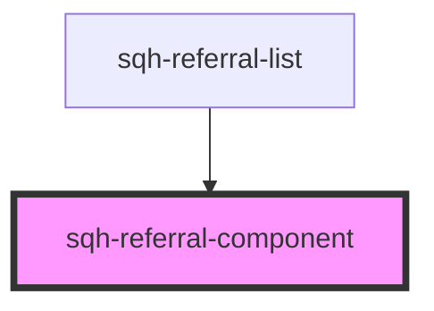

# sqh-referral-component

<!-- Auto Generated Below -->

## Properties

| Property            | Attribute      | Description                                                    | Type                                     | Default     |
| ------------------- | -------------- | -------------------------------------------------------------- | ---------------------------------------- | ----------- |
| `locale`            | `locale`       | Configure the local                                            | `string`                                 | `undefined` |
| `referral`          | --             | Referral object                                                | `Referral \| ReferredByReferral`         | `undefined` |
| `referraltype`      | `referraltype` | Type of referral                                               | `"converted" \| "pending" \| "referrer"` | `undefined` |
| `referralvariables` | --             | Referral variables used to format the row in the referral list | `ReferralVariables`                      | `undefined` |
| `unknownuser`       | --             | Text shown when the name of a user is unknown                  | `String`                                 | `undefined` |

## Dependencies

### Used by

 - [sqh-referral-list](../referral-list)

### Graph

----------------------------------------------

*Built with [StencilJS](https://stenciljs.com/)*
