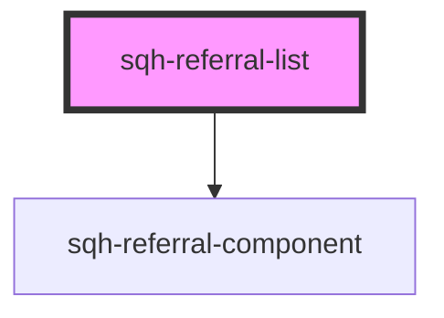

# sqh-referral-list

<!-- Auto Generated Below -->

## Properties

| Property               | Attribute              | Description                                                                       | Type      | Default     |
| ---------------------- | ---------------------- | --------------------------------------------------------------------------------- | --------- | ----------- |
| `cancelledcolor`       | `cancelledcolor`       | Color of the cancelled icon and text                                              | `string`  | `undefined` |
| `cancelledcontent`     | `cancelledcontent`     | Cancelled text content shown in the user column                                   | `string`  | `undefined` |
| `cancelledvalue`       | `cancelledvalue`       | Cancelled text content shown alongside the icon in the referral column            | `string`  | `undefined` |
| `convertedcontent`     | `convertedcontent`     | Content shown when a referral is converted                                        | `string`  | `undefined` |
| `customernotecolor`    | `customernotecolor`    | Color of the customer note                                                        | `string`  | `undefined` |
| `expiredcolor`         | `expiredcolor`         | Color of the expired icon and text                                                | `string`  | `undefined` |
| `expiredcontent`       | `expiredcontent`       | Expired content shown in the user column                                          | `string`  | `undefined` |
| `expiredvalue`         | `expiredvalue`         | Expired content shown alongside the icon in the referral column                   | `string`  | `undefined` |
| `expiresvalue`         | `expiresvalue`         | Reward expiry ICU message                                                         | `string`  | `undefined` |
| `internationalization` | `internationalization` | When true, the local gets set by using the value passed to the referral component | `boolean` | `undefined` |
| `ishidden`             | `ishidden`             | Hide or show the component                                                        | `boolean` | `undefined` |
| `noreferralsyet`       | `noreferralsyet`       | Shown when referral list is empty                                                 | `string`  | `undefined` |
| `paginateless`         | `paginateless`         | Shown inside the paginate less button                                             | `string`  | `undefined` |
| `paginatemore`         | `paginatemore`         | Shown inside the paginate more button                                             | `string`  | `undefined` |
| `pendingcolor`         | `pendingcolor`         | Color of the pending icon and text                                                | `string`  | `undefined` |
| `pendingcontent`       | `pendingcontent`       | Pending content shown in the user column                                          | `string`  | `undefined` |
| `pendingvalue`         | `pendingvalue`         | Pending content shown alongside the icon in the referral column                   | `string`  | `undefined` |
| `redeemedvalue`        | `redeemedvalue`        | Shown when reward is redeemed                                                     | `string`  | `undefined` |
| `referralnamecolor`    | `referralnamecolor`    | Text color of the referred users name                                             | `string`  | `undefined` |
| `referraltextcolor`    | `referraltextcolor`    | Text color of the referral status                                                 | `string`  | `undefined` |
| `referrercontent`      | `referrercontent`      | Text explaining who referred you to the program                                   | `string`  | `undefined` |
| `referrervalue`        | `referrervalue`        | Referred Text shown in reward column                                              | `string`  | `undefined` |
| `rewardcolor`          | `rewardcolor`          | Color of the successful reward icon and the text value                            | `string`  | `undefined` |
| `showexpiry`           | `showexpiry`           | Show or hide expired rewards                                                      | `boolean` | `undefined` |
| `shownotes`            | `shownotes`            | Show the customer note for a referral                                             | `boolean` | `undefined` |
| `showreferrer`         | `showreferrer`         | Show or hide the referrer                                                         | `boolean` | `undefined` |
| `unknownuser`          | `unknownuser`          | Text shown when the referred users name is unknown                                | `string`  | `undefined` |
| `usefirstreward`       | `usefirstreward`       | Show value of the first earned reward inside the rewards column                   | `boolean` | `undefined` |
| `valuecontent`         | `valuecontent`         | Value shown in the rewards column                                                 | `string`  | `undefined` |

## Dependencies

### Depends on

- [sqh-referral-component](../referral-component)

### Graph

----------------------------------------------

*Built with [StencilJS](https://stenciljs.com/)*
