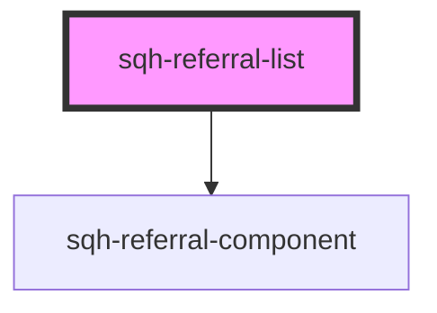

# sqh-referral-list

<!-- Auto Generated Below -->

## Properties

| Property               | Attribute              | Description                                                                                                                                       | Type      | Default     |
| ---------------------- | ---------------------- | ------------------------------------------------------------------------------------------------------------------------------------------------- | --------- | ----------- |
| `cancelledcolor`       | `cancelledcolor`       | Color of the cancelled icon and text in the rewards column.                                                                                       | `string`  | `undefined` |
| `cancelledcontent`     | `cancelledcontent`     | Content shown in the referral column for a cancelled reward.                                                                                      | `string`  | `undefined` |
| `cancelledvalue`       | `cancelledvalue`       | Text shown alongside the icon in the referral column for a cancelled reward.                                                                      | `string`  | `undefined` |
| `convertedcontent`     | `convertedcontent`     | Description shown when a referral is converted.                                                                                                   | `string`  | `undefined` |
| `customernotecolor`    | `customernotecolor`    |                                                                                                                                                   | `string`  | `undefined` |
| `expiredcolor`         | `expiredcolor`         | Color of the expired reward icon and text in the rewards column.                                                                                  | `string`  | `undefined` |
| `expiredcontent`       | `expiredcontent`       | Expired text shown in the referral column.                                                                                                        | `string`  | `undefined` |
| `expiredvalue`         | `expiredvalue`         | Expired text shown alongside the icon in the referral column.                                                                                     | `string`  | `undefined` |
| `expiresvalue`         | `expiresvalue`         | Reward expiry ICU message                                                                                                                         | `string`  | `undefined` |
| `internationalization` | `internationalization` | Use the value passed to the referral component to set the locale of the user.                                                                     | `boolean` | `undefined` |
| `ishidden`             | `ishidden`             |                                                                                                                                                   | `boolean` | `undefined` |
| `noreferralsyet`       | `noreferralsyet`       | Shown when referral list is empty.                                                                                                                | `string`  | `undefined` |
| `paginateless`         | `paginateless`         | Shown inside the paginate less button.                                                                                                            | `string`  | `undefined` |
| `paginatemore`         | `paginatemore`         | Shown inside the paginate more button.                                                                                                            | `string`  | `undefined` |
| `pendingcolor`         | `pendingcolor`         | Color of the pending reward icon and text in the rewards column.                                                                                  | `string`  | `undefined` |
| `pendingcontent`       | `pendingcontent`       | Pending description shown in the referral column.                                                                                                 | `string`  | `undefined` |
| `pendingvalue`         | `pendingvalue`         | Pending text shown alongside the icon in the referral column.                                                                                     | `string`  | `undefined` |
| `redeemedvalue`        | `redeemedvalue`        | Shown when reward is redeemed.                                                                                                                    | `string`  | `undefined` |
| `referralnamecolor`    | `referralnamecolor`    | Text color of the referred user's name.                                                                                                           | `string`  | `undefined` |
| `referraltextcolor`    | `referraltextcolor`    |                                                                                                                                                   | `string`  | `undefined` |
| `referrercontent`      | `referrercontent`      | Text explaining who referred you to the program.                                                                                                  | `string`  | `undefined` |
| `referrervalue`        | `referrervalue`        | Referred Text shown in reward column.                                                                                                             | `string`  | `undefined` |
| `rewardcolor`          | `rewardcolor`          | Color of the successful reward icon and text in the rewards column.                                                                               | `string`  | `undefined` |
| `showexpiry`           | `showexpiry`           |                                                                                                                                                   | `boolean` | `undefined` |
| `shownotes`            | `shownotes`            |                                                                                                                                                   | `boolean` | `undefined` |
| `showreferrer`         | `showreferrer`         | Show referral and reward information on who referred you.                                                                                         | `boolean` | `undefined` |
| `unknownuser`          | `unknownuser`          | Text shown when the referred user's name is unknown.                                                                                              | `string`  | `undefined` |
| `usefirstreward`       | `usefirstreward`       | Show the value of the first earned reward inside the rewards column.                                                                              | `boolean` | `undefined` |
| `valuecontent`         | `valuecontent`         | ICU message shown in the rewards column. See [ICU messages](https://unicode-org.github.io/icu/userguide/format_parse/messages/) for more details. | `string`  | `undefined` |

## Dependencies

### Depends on

- [sqh-referral-component](../referral-component)

### Graph

---

_Built with [StencilJS](https://stenciljs.com/)_
