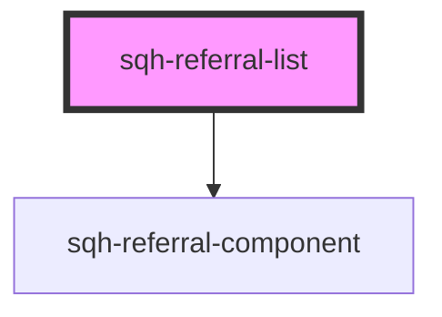

# sqh-referral-list

<!-- Auto Generated Below -->

## Properties

| Property               | Attribute              | Description | Type      | Default     |
| ---------------------- | ---------------------- | ----------- | --------- | ----------- |
| `cancelledcolor`       | `cancelledcolor`       |             | `string`  | `undefined` |
| `cancelledcontent`     | `cancelledcontent`     |             | `string`  | `undefined` |
| `cancelledvalue`       | `cancelledvalue`       |             | `string`  | `undefined` |
| `convertedcontent`     | `convertedcontent`     |             | `string`  | `undefined` |
| `customernotecolor`    | `customernotecolor`    |             | `string`  | `undefined` |
| `expiredcolor`         | `expiredcolor`         |             | `string`  | `undefined` |
| `expiredcontent`       | `expiredcontent`       |             | `string`  | `undefined` |
| `expiredvalue`         | `expiredvalue`         |             | `string`  | `undefined` |
| `internationalization` | `internationalization` |             | `boolean` | `undefined` |
| `ishidden`             | `ishidden`             |             | `boolean` | `undefined` |
| `noreferralsyet`       | `noreferralsyet`       |             | `string`  | `undefined` |
| `paginateless`         | `paginateless`         |             | `string`  | `undefined` |
| `paginatemore`         | `paginatemore`         |             | `string`  | `undefined` |
| `pendingcolor`         | `pendingcolor`         |             | `string`  | `undefined` |
| `pendingcontent`       | `pendingcontent`       |             | `string`  | `undefined` |
| `pendingvalue`         | `pendingvalue`         |             | `string`  | `undefined` |
| `redeemedvalue`        | `redeemedvalue`        |             | `string`  | `undefined` |
| `referralnamecolor`    | `referralnamecolor`    |             | `string`  | `undefined` |
| `referraltextcolor`    | `referraltextcolor`    |             | `string`  | `undefined` |
| `referrercontent`      | `referrercontent`      |             | `string`  | `undefined` |
| `referrervalue`        | `referrervalue`        |             | `string`  | `undefined` |
| `rewardcolor`          | `rewardcolor`          |             | `string`  | `undefined` |
| `showexpiry`           | `showexpiry`           |             | `boolean` | `undefined` |
| `shownotes`            | `shownotes`            |             | `boolean` | `undefined` |
| `showreferrer`         | `showreferrer`         |             | `boolean` | `undefined` |
| `unknownuser`          | `unknownuser`          |             | `string`  | `undefined` |
| `usefirstreward`       | `usefirstreward`       |             | `boolean` | `undefined` |
| `valuecontent`         | `valuecontent`         |             | `string`  | `undefined` |

## Dependencies

### Depends on

- [sqh-referral-component](../referral-component)

### Graph

----------------------------------------------

*Built with [StencilJS](https://stenciljs.com/)*
