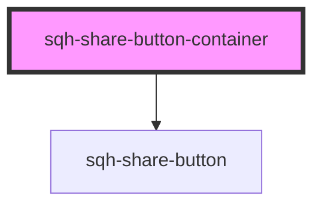

# sqh-share-button-container

<!-- Auto Generated Below -->

## Properties

| Property                   | Attribute                  | Description | Type      | Default         |
| -------------------------- | -------------------------- | ----------- | --------- | --------------- |
| `emailbackgroundcolor`     | `emailbackgroundcolor`     |             | `string`  | `undefined`     |
| `emailclassName`           | `emailclass-name`          |             | `string`  | `"email-share"` |
| `emaildisplayrule`         | `emaildisplayrule`         |             | `string`  | `undefined`     |
| `emailicon`                | `emailicon`                |             | `string`  | `"mail"`        |
| `emailiconhorizontal`      | `emailiconhorizontal`      |             | `number`  | `undefined`     |
| `emailiconsize`            | `emailiconsize`            |             | `number`  | `undefined`     |
| `emailiconvertical`        | `emailiconvertical`        |             | `number`  | `undefined`     |
| `emailtext`                | `emailtext`                |             | `string`  | `undefined`     |
| `emailtextcolor`           | `emailtextcolor`           |             | `string`  | `undefined`     |
| `facebookbackgroundcolor`  | `facebookbackgroundcolor`  |             | `string`  | `undefined`     |
| `facebookclassName`        | `facebookclass-name`       |             | `string`  | `undefined`     |
| `facebookdisplayrule`      | `facebookdisplayrule`      |             | `string`  | `undefined`     |
| `facebookicon`             | `facebookicon`             |             | `string`  | `"facebook"`    |
| `facebookiconhorizontal`   | `facebookiconhorizontal`   |             | `number`  | `9`             |
| `facebookiconsize`         | `facebookiconsize`         |             | `number`  | `1.2`           |
| `facebookiconvertical`     | `facebookiconvertical`     |             | `number`  | `undefined`     |
| `facebooktext`             | `facebooktext`             |             | `string`  | `undefined`     |
| `facebooktextcolor`        | `facebooktextcolor`        |             | `string`  | `undefined`     |
| `ishidden`                 | `ishidden`                 |             | `boolean` | `undefined`     |
| `linebackgroundcolor`      | `linebackgroundcolor`      |             | `string`  | `undefined`     |
| `lineclassName`            | `lineclass-name`           |             | `string`  | `undefined`     |
| `linedisplayrule`          | `linedisplayrule`          |             | `string`  | `undefined`     |
| `lineicon`                 | `lineicon`                 |             | `string`  | `"line"`        |
| `lineiconhorizontal`       | `lineiconhorizontal`       |             | `number`  | `-2`            |
| `lineiconsize`             | `lineiconsize`             |             | `number`  | `2.2`           |
| `lineiconvertical`         | `lineiconvertical`         |             | `number`  | `-5`            |
| `linetext`                 | `linetext`                 |             | `string`  | `undefined`     |
| `linetextcolor`            | `linetextcolor`            |             | `string`  | `undefined`     |
| `linkedinbackgroundcolor`  | `linkedinbackgroundcolor`  |             | `string`  | `undefined`     |
| `linkedinclassName`        | `linkedinclass-name`       |             | `string`  | `undefined`     |
| `linkedindisplayrule`      | `linkedindisplayrule`      |             | `string`  | `undefined`     |
| `linkedinicon`             | `linkedinicon`             |             | `string`  | `"linkedin"`    |
| `linkediniconhorizontal`   | `linkediniconhorizontal`   |             | `number`  | `undefined`     |
| `linkediniconsize`         | `linkediniconsize`         |             | `number`  | `1.2`           |
| `linkediniconvertical`     | `linkediniconvertical`     |             | `number`  | `undefined`     |
| `linkedintext`             | `linkedintext`             |             | `string`  | `undefined`     |
| `linkedintextcolor`        | `linkedintextcolor`        |             | `string`  | `undefined`     |
| `messengerbackgroundcolor` | `messengerbackgroundcolor` |             | `string`  | `undefined`     |
| `messengerclassName`       | `messengerclass-name`      |             | `string`  | `undefined`     |
| `messengerdisplayrule`     | `messengerdisplayrule`     |             | `string`  | `undefined`     |
| `messengericon`            | `messengericon`            |             | `string`  | `"messenger"`   |
| `messengericonhorizontal`  | `messengericonhorizontal`  |             | `number`  | `7`             |
| `messengericonsize`        | `messengericonsize`        |             | `number`  | `1.4`           |
| `messengericonvertical`    | `messengericonvertical`    |             | `number`  | `3`             |
| `messengertext`            | `messengertext`            |             | `string`  | `undefined`     |
| `messengertextcolor`       | `messengertextcolor`       |             | `string`  | `undefined`     |
| `pinterestbackgroundcolor` | `pinterestbackgroundcolor` |             | `string`  | `undefined`     |
| `pinterestclassName`       | `pinterestclass-name`      |             | `string`  | `undefined`     |
| `pinterestdisplayrule`     | `pinterestdisplayrule`     |             | `string`  | `undefined`     |
| `pinteresticon`            | `pinteresticon`            |             | `string`  | `"pinterest"`   |
| `pinteresticonhorizontal`  | `pinteresticonhorizontal`  |             | `number`  | `9`             |
| `pinteresticonsize`        | `pinteresticonsize`        |             | `number`  | `1.2`           |
| `pinteresticonvertical`    | `pinteresticonvertical`    |             | `number`  | `4`             |
| `pinteresttext`            | `pinteresttext`            |             | `string`  | `undefined`     |
| `pinteresttextcolor`       | `pinteresttextcolor`       |             | `string`  | `undefined`     |
| `smsbackgroundcolor`       | `smsbackgroundcolor`       |             | `string`  | `undefined`     |
| `smsclassName`             | `smsclass-name`            |             | `string`  | `undefined`     |
| `smsdisplayrule`           | `smsdisplayrule`           |             | `string`  | `undefined`     |
| `smsicon`                  | `smsicon`                  |             | `string`  | `"chat"`        |
| `smsiconhorizontal`        | `smsiconhorizontal`        |             | `number`  | `undefined`     |
| `smsiconsize`              | `smsiconsize`              |             | `number`  | `undefined`     |
| `smsiconvertical`          | `smsiconvertical`          |             | `number`  | `undefined`     |
| `smstext`                  | `smstext`                  |             | `string`  | `undefined`     |
| `smstextcolor`             | `smstextcolor`             |             | `string`  | `undefined`     |
| `twitterbackgroundcolor`   | `twitterbackgroundcolor`   |             | `string`  | `undefined`     |
| `twitterclassName`         | `twitterclass-name`        |             | `string`  | `undefined`     |
| `twitterdisplayrule`       | `twitterdisplayrule`       |             | `string`  | `undefined`     |
| `twittericon`              | `twittericon`              |             | `string`  | `"twitter"`     |
| `twittericonhorizontal`    | `twittericonhorizontal`    |             | `number`  | `9`             |
| `twittericonsize`          | `twittericonsize`          |             | `number`  | `1.2`           |
| `twittericonvertical`      | `twittericonvertical`      |             | `number`  | `undefined`     |
| `twittertext`              | `twittertext`              |             | `string`  | `undefined`     |
| `twittertextcolor`         | `twittertextcolor`         |             | `string`  | `undefined`     |
| `whatsappbackgroundcolor`  | `whatsappbackgroundcolor`  |             | `string`  | `undefined`     |
| `whatsappclassName`        | `whatsappclass-name`       |             | `string`  | `undefined`     |
| `whatsappdisplayrule`      | `whatsappdisplayrule`      |             | `string`  | `undefined`     |
| `whatsappicon`             | `whatsappicon`             |             | `string`  | `"whatsapp"`    |
| `whatsappiconhorizontal`   | `whatsappiconhorizontal`   |             | `number`  | `7`             |
| `whatsappiconsize`         | `whatsappiconsize`         |             | `number`  | `1.4`           |
| `whatsappiconvertical`     | `whatsappiconvertical`     |             | `number`  | `2`             |
| `whatsapptext`             | `whatsapptext`             |             | `string`  | `undefined`     |
| `whatsapptextcolor`        | `whatsapptextcolor`        |             | `string`  | `"#fff"`        |

## Dependencies

### Depends on

- [sqh-share-button](../share-button)

### Graph

---

_Built with [StencilJS](https://stenciljs.com/)_
