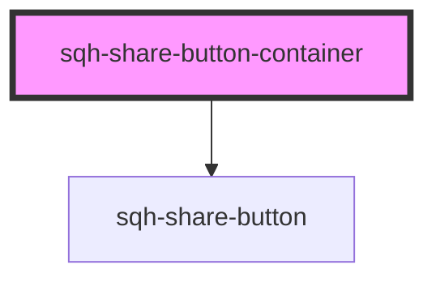

# sqh-share-button-container

<!-- Auto Generated Below -->

## Properties

| Property                   | Attribute                  | Description                                                          | Type      | Default         |
| -------------------------- | -------------------------- | -------------------------------------------------------------------- | --------- | --------------- |
| `emailbackgroundcolor`     | `emailbackgroundcolor`     | Background color of the Email button                                 | `string`  | `undefined`     |
| `emailclassName`           | `emailclass-name`          | CSS Class name used to style the Email button                        | `string`  | `"email-share"` |
| `emaildisplayrule`         | `emaildisplayrule`         | Show and hide button depending on what type of device the user is on | `string`  | `undefined`     |
| `emailicon`                | `emailicon`                | Email button icon                                                    | `string`  | `"mail"`        |
| `emailiconhorizontal`      | `emailiconhorizontal`      | Number to horizontally align the Email button icon                   | `number`  | `undefined`     |
| `emailiconsize`            | `emailiconsize`            | Size of the Email button icon                                        | `number`  | `undefined`     |
| `emailiconvertical`        | `emailiconvertical`        | Number to vertically align the Email button icon                     | `number`  | `undefined`     |
| `emailtext`                | `emailtext`                | Text inside the Email button                                         | `string`  | `undefined`     |
| `emailtextcolor`           | `emailtextcolor`           | Color of the text inside the Email button                            | `string`  | `undefined`     |
| `facebookbackgroundcolor`  | `facebookbackgroundcolor`  | Background color of the facebook button                              | `string`  | `undefined`     |
| `facebookclassName`        | `facebookclass-name`       | CSS Class name used to style the facebook button                     | `string`  | `undefined`     |
| `facebookdisplayrule`      | `facebookdisplayrule`      | Show and hide button depending on what type of device the user is on | `string`  | `undefined`     |
| `facebookicon`             | `facebookicon`             | Facebook button icon                                                 | `string`  | `"facebook"`    |
| `facebookiconhorizontal`   | `facebookiconhorizontal`   | Number to horizontally align the facebook button icon                | `number`  | `9`             |
| `facebookiconsize`         | `facebookiconsize`         | Size of the facebook button icon                                     | `number`  | `1.2`           |
| `facebookiconvertical`     | `facebookiconvertical`     | Number to vertically align the facebook button icon                  | `number`  | `undefined`     |
| `facebooktext`             | `facebooktext`             | Text inside the facebook button                                      | `string`  | `undefined`     |
| `facebooktextcolor`        | `facebooktextcolor`        | Color of the text inside the facebook button                         | `string`  | `undefined`     |
| `ishidden`                 | `ishidden`                 | Hide or show the component                                           | `boolean` | `undefined`     |
| `linebackgroundcolor`      | `linebackgroundcolor`      | Background color of the Line button                                  | `string`  | `undefined`     |
| `lineclassName`            | `lineclass-name`           | CSS Class name used to style the Line button                         | `string`  | `undefined`     |
| `linedisplayrule`          | `linedisplayrule`          | Show and hide button depending on what type of device the user is on | `string`  | `undefined`     |
| `lineicon`                 | `lineicon`                 | Line button icon                                                     | `string`  | `"line"`        |
| `lineiconhorizontal`       | `lineiconhorizontal`       | Number to horizontally align the Line button icon                    | `number`  | `-2`            |
| `lineiconsize`             | `lineiconsize`             | Size of the Line button icon                                         | `number`  | `2.2`           |
| `lineiconvertical`         | `lineiconvertical`         | Number to vertically align the Line button icon                      | `number`  | `-5`            |
| `linetext`                 | `linetext`                 | Text inside the Line button                                          | `string`  | `undefined`     |
| `linetextcolor`            | `linetextcolor`            | Color of the text inside the Line button                             | `string`  | `undefined`     |
| `linkedinbackgroundcolor`  | `linkedinbackgroundcolor`  | Background color of the linkedin button                              | `string`  | `undefined`     |
| `linkedinclassName`        | `linkedinclass-name`       | CSS Class name used to style the Linkedin button                     | `string`  | `undefined`     |
| `linkedindisplayrule`      | `linkedindisplayrule`      | Show and hide button depending on what type of device the user is on | `string`  | `undefined`     |
| `linkedinicon`             | `linkedinicon`             | Linkedin button icon                                                 | `string`  | `"linkedin"`    |
| `linkediniconhorizontal`   | `linkediniconhorizontal`   | Number to horizontally align the Linkedin button icon                | `number`  | `undefined`     |
| `linkediniconsize`         | `linkediniconsize`         | Size of the Linkedin button icon                                     | `number`  | `1.2`           |
| `linkediniconvertical`     | `linkediniconvertical`     | Number to vertically align the Linkedin button icon                  | `number`  | `undefined`     |
| `linkedintext`             | `linkedintext`             | Text inside the linkedin button                                      | `string`  | `undefined`     |
| `linkedintextcolor`        | `linkedintextcolor`        | Color of the text inside the Linkedin button                         | `string`  | `undefined`     |
| `messengerbackgroundcolor` | `messengerbackgroundcolor` | Background color of the Messenger button                             | `string`  | `undefined`     |
| `messengerclassName`       | `messengerclass-name`      | CSS Class name used to style the Messenger button                    | `string`  | `undefined`     |
| `messengerdisplayrule`     | `messengerdisplayrule`     | Show and hide button depending on what type of device the user is on | `string`  | `undefined`     |
| `messengericon`            | `messengericon`            | Messenger button icon                                                | `string`  | `"messenger"`   |
| `messengericonhorizontal`  | `messengericonhorizontal`  | Number to horizontally align the Messenger button icon               | `number`  | `7`             |
| `messengericonsize`        | `messengericonsize`        | Size of the Messenger button icon                                    | `number`  | `1.4`           |
| `messengericonvertical`    | `messengericonvertical`    | Number to vertically align the Messenger button icon                 | `number`  | `3`             |
| `messengertext`            | `messengertext`            | Text inside the Messenger button                                     | `string`  | `undefined`     |
| `messengertextcolor`       | `messengertextcolor`       | Color of the text inside the Messenger button                        | `string`  | `undefined`     |
| `pinterestbackgroundcolor` | `pinterestbackgroundcolor` | Background color of the Pinterest button                             | `string`  | `undefined`     |
| `pinterestclassName`       | `pinterestclass-name`      | CSS Class name used to style the Pinterest button                    | `string`  | `undefined`     |
| `pinterestdisplayrule`     | `pinterestdisplayrule`     | Show and hide button depending on what type of device the user is on | `string`  | `undefined`     |
| `pinteresticon`            | `pinteresticon`            | Pinterest button icon                                                | `string`  | `"pinterest"`   |
| `pinteresticonhorizontal`  | `pinteresticonhorizontal`  | Number to horizontally align the Pinterest button icon               | `number`  | `9`             |
| `pinteresticonsize`        | `pinteresticonsize`        | Size of the Pinterest button icon                                    | `number`  | `1.2`           |
| `pinteresticonvertical`    | `pinteresticonvertical`    | Number to vertically align the Pinterest button icon                 | `number`  | `4`             |
| `pinteresttext`            | `pinteresttext`            | Text inside the Pinterest button                                     | `string`  | `undefined`     |
| `pinteresttextcolor`       | `pinteresttextcolor`       | Color of the text inside the Pinterest button                        | `string`  | `undefined`     |
| `smsbackgroundcolor`       | `smsbackgroundcolor`       | Background color of the SMS button                                   | `string`  | `undefined`     |
| `smsclassName`             | `smsclass-name`            | CSS Class name used to style the SMS button                          | `string`  | `undefined`     |
| `smsdisplayrule`           | `smsdisplayrule`           | Show and hide button depending on what type of device the user is on | `string`  | `undefined`     |
| `smsicon`                  | `smsicon`                  | SMS button icon                                                      | `string`  | `"chat"`        |
| `smsiconhorizontal`        | `smsiconhorizontal`        | Number to horizontally align the SMS button icon                     | `number`  | `undefined`     |
| `smsiconsize`              | `smsiconsize`              | Size of the SMS button icon                                          | `number`  | `undefined`     |
| `smsiconvertical`          | `smsiconvertical`          | Number to vertically align the SMS button icon                       | `number`  | `undefined`     |
| `smstext`                  | `smstext`                  | Text inside the SMS button                                           | `string`  | `undefined`     |
| `smstextcolor`             | `smstextcolor`             | Color of the text inside the SMS button                              | `string`  | `undefined`     |
| `twitterbackgroundcolor`   | `twitterbackgroundcolor`   | Background color of the twitter button                               | `string`  | `undefined`     |
| `twitterclassName`         | `twitterclass-name`        | CSS Class name used to style the twitter button                      | `string`  | `undefined`     |
| `twitterdisplayrule`       | `twitterdisplayrule`       | Show and hide button depending on what type of device the user is on | `string`  | `undefined`     |
| `twittericon`              | `twittericon`              | Twitter button icon                                                  | `string`  | `"twitter"`     |
| `twittericonhorizontal`    | `twittericonhorizontal`    | Number to horizontally align the twitter button icon                 | `number`  | `9`             |
| `twittericonsize`          | `twittericonsize`          | Size of the twitter button icon                                      | `number`  | `1.2`           |
| `twittericonvertical`      | `twittericonvertical`      | Number to vertically align the twitter button icon                   | `number`  | `undefined`     |
| `twittertext`              | `twittertext`              | Text inside the twitter button                                       | `string`  | `undefined`     |
| `twittertextcolor`         | `twittertextcolor`         | Color of the text inside the twitter button                          | `string`  | `undefined`     |
| `whatsappbackgroundcolor`  | `whatsappbackgroundcolor`  | Background color of the WhatsApp button                              | `string`  | `undefined`     |
| `whatsappclassName`        | `whatsappclass-name`       | CSS Class name used to style the WhatsApp button                     | `string`  | `undefined`     |
| `whatsappdisplayrule`      | `whatsappdisplayrule`      | Show and hide button depending on what type of device the user is on | `string`  | `undefined`     |
| `whatsappicon`             | `whatsappicon`             | WhatsApp button icon                                                 | `string`  | `"whatsapp"`    |
| `whatsappiconhorizontal`   | `whatsappiconhorizontal`   | Number to horizontally align the WhatsApp button icon                | `number`  | `7`             |
| `whatsappiconsize`         | `whatsappiconsize`         | Size of the WhatsApp button icon                                     | `number`  | `1.4`           |
| `whatsappiconvertical`     | `whatsappiconvertical`     | Number to vertically align the WhatsApp button icon                  | `number`  | `2`             |
| `whatsapptext`             | `whatsapptext`             | Text inside the WhatsApp button                                      | `string`  | `undefined`     |
| `whatsapptextcolor`        | `whatsapptextcolor`        | Color of the text inside the WhatsApp button                         | `string`  | `"#fff"`        |

## Dependencies

### Depends on

- [sqh-share-button](../share-button)

### Graph

----------------------------------------------

*Built with [StencilJS](https://stenciljs.com/)*
