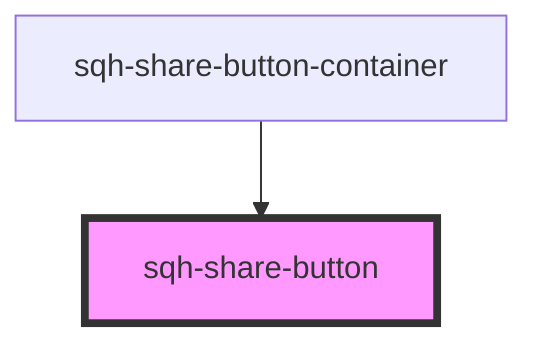

# sqh-share-button

<!-- Auto Generated Below -->

## Properties

| Property          | Attribute           | Description | Type     | Default     |
| ----------------- | ------------------- | ----------- | -------- | ----------- |
| `backgroundcolor` | `backgroundcolor`   |             | `string` | `undefined` |
| `buttonClassName` | `button-class-name` |             | `string` | `undefined` |
| `displayrule`     | `displayrule`       |             | `string` | `undefined` |
| `icon`            | `icon`              |             | `string` | `undefined` |
| `iconhorizontal`  | `iconhorizontal`    |             | `number` | `undefined` |
| `iconsize`        | `iconsize`          |             | `number` | `undefined` |
| `iconvertical`    | `iconvertical`      |             | `number` | `undefined` |
| `text`            | `text`              |             | `string` | `undefined` |
| `textcolor`       | `textcolor`         |             | `string` | `undefined` |
| `type`            | `type`              |             | `string` | `undefined` |
| `url`             | `url`               |             | `string` | `undefined` |

## Dependencies

### Used by

- [sqh-share-button-container](../share-button-container)

### Graph

---

_Built with [StencilJS](https://stenciljs.com/)_
