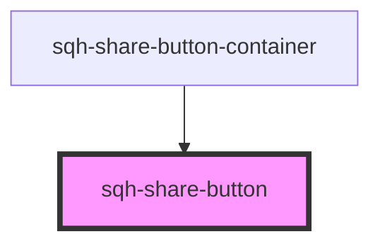

# sqh-share-button

<!-- Auto Generated Below -->

## Properties

| Property          | Attribute           | Description                                                          | Type     | Default     |
| ----------------- | ------------------- | -------------------------------------------------------------------- | -------- | ----------- |
| `backgroundcolor` | `backgroundcolor`   | Background color of the Share button                                 | `string` | `undefined` |
| `buttonClassName` | `button-class-name` | CSS Class name used to style the Share button                        | `string` | `undefined` |
| `displayrule`     | `displayrule`       | Show and hide button depending on what type of device the user is on | `string` | `undefined` |
| `icon`            | `icon`              | Share button icon                                                    | `string` | `undefined` |
| `iconhorizontal`  | `iconhorizontal`    | Number to horizontally align the Share button icon                   | `number` | `undefined` |
| `iconsize`        | `iconsize`          | Size of the Share button icon                                        | `number` | `undefined` |
| `iconvertical`    | `iconvertical`      | Number to vertically align the Share button icon                     | `number` | `undefined` |
| `text`            | `text`              | Text inside the Share button                                         | `string` | `undefined` |
| `textcolor`       | `textcolor`         | Color of the text inside the Share button                            | `string` | `undefined` |
| `type`            | `type`              | Type of the share button                                             | `string` | `undefined` |
| `url`             | `url`               | URL redirect location                                                | `string` | `undefined` |

## Dependencies

### Used by

 - [sqh-share-button-container](../share-button-container)

### Graph

----------------------------------------------

*Built with [StencilJS](https://stenciljs.com/)*
