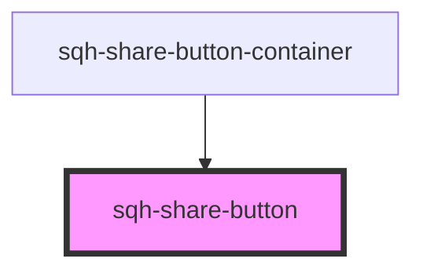

# sqh-share-button

<!-- Auto Generated Below -->

## Properties

| Property          | Attribute           | Description                                                                                                                                        | Type     | Default     |
| ----------------- | ------------------- | -------------------------------------------------------------------------------------------------------------------------------------------------- | -------- | ----------- |
| `backgroundcolor` | `backgroundcolor`   | Background color of the share button                                                                                                               | `string` | `undefined` |
| `buttonClassName` | `button-class-name` | CSS Class name used to style the share button                                                                                                      | `string` | `undefined` |
| `displayrule`     | `displayrule`       | Show or hide button depending on what type of device the user is on                                                                                | `string` | `undefined` |
| `icon`            | `icon`              | Full list of valid icon names available in the {@link https://shoelace.style/components/icon Shoelace Icon Library}. This value is case sensitive. | `string` | `undefined` |
| `iconhorizontal`  | `iconhorizontal`    | Number to horizontally align the share button icon                                                                                                 | `number` | `undefined` |
| `iconsize`        | `iconsize`          | Size of the Share button icon in em units                                                                                                          | `number` | `undefined` |
| `iconvertical`    | `iconvertical`      | Number to vertically align the share button icon                                                                                                   | `number` | `undefined` |
| `text`            | `text`              | Text inside the share button                                                                                                                       | `string` | `undefined` |
| `textcolor`       | `textcolor`         | Color of the text inside the share button                                                                                                          | `string` | `undefined` |
| `type`            | `type`              |                                                                                                                                                    | `string` | `undefined` |
| `url`             | `url`               | URL redirect location                                                                                                                              | `string` | `undefined` |

## Dependencies

### Used by

 - [sqh-share-button-container](../share-button-container)

### Graph

----------------------------------------------

*Built with [StencilJS](https://stenciljs.com/)*
